# AutoCoin - 个人记账软件

一款基于 Web 的个人记账与统计分析工具，支持支付宝、微信支付账单导入及**图片智能识别导入**（基于多模态 LLM），提供收支分析、图表可视化和多维度统计功能。支持多用户隔离、暗黑模式与移动端适配。

> GitHub: [https://github.com/hnkjdaxzzq/autocoin](https://github.com/hnkjdaxzzq/autocoin)

## 界面预览

### 桌面端

| 概览 | 账单明细 |
|:---:|:---:|
|  | 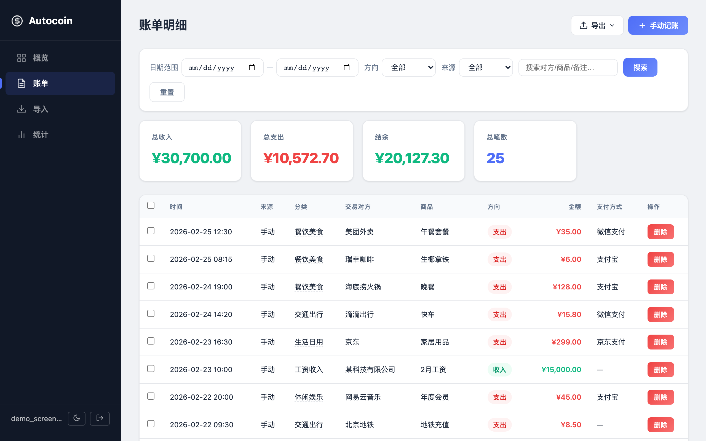 |

| 统计分析 | 导入 |
|:---:|:---:|
| 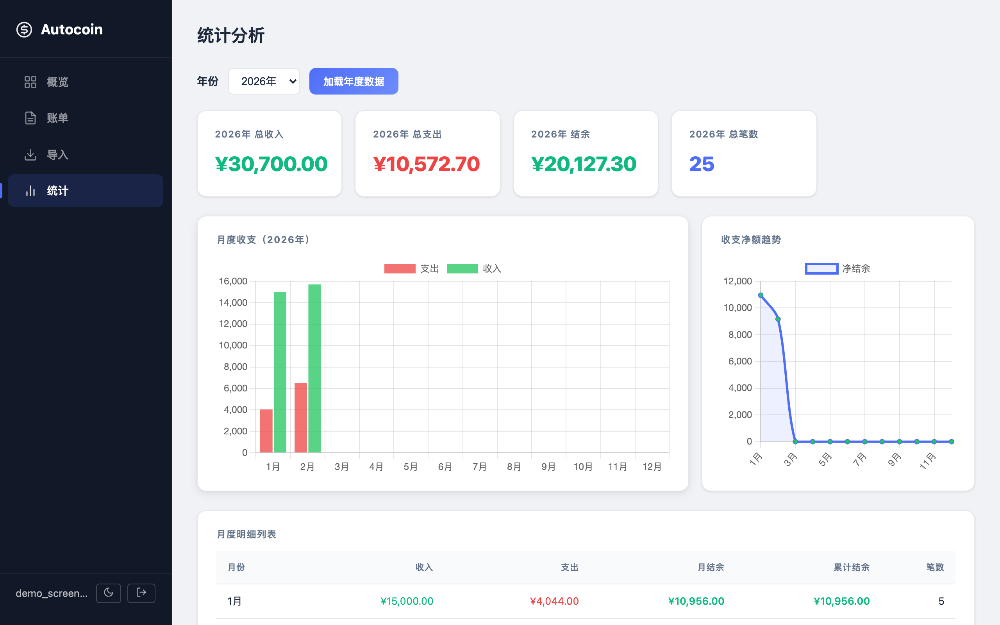 | 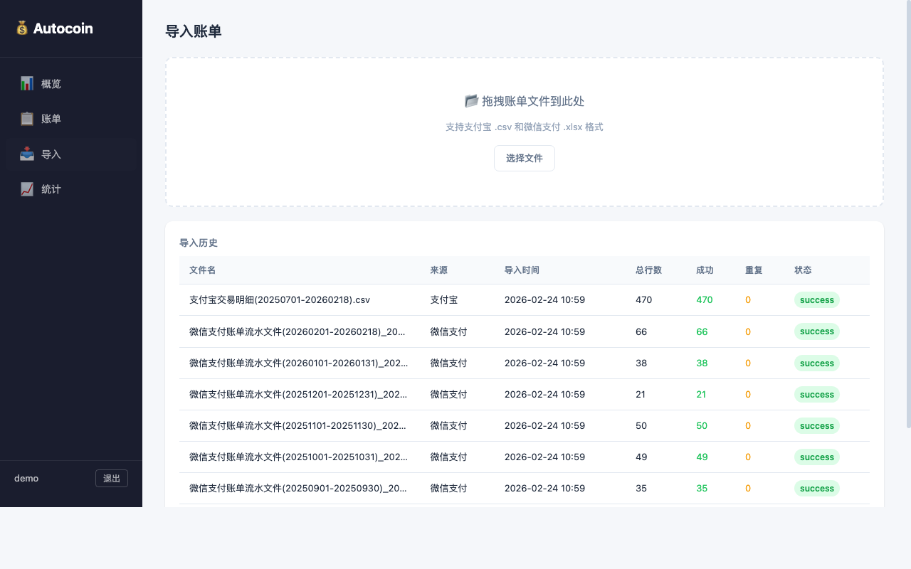 |

| 导出下拉菜单 | 批量操作 |
|:---:|:---:|
| 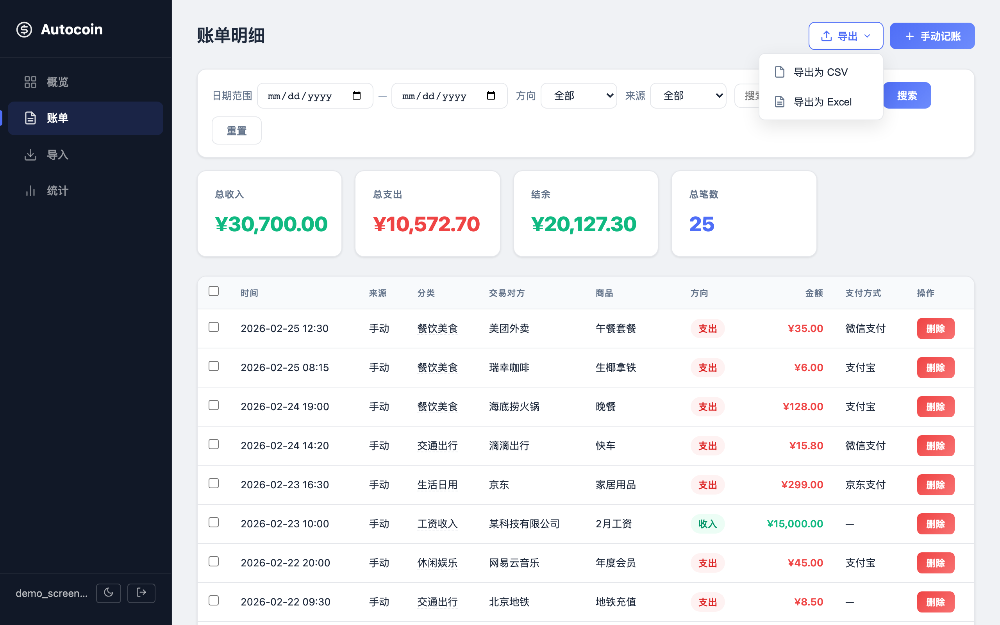 | 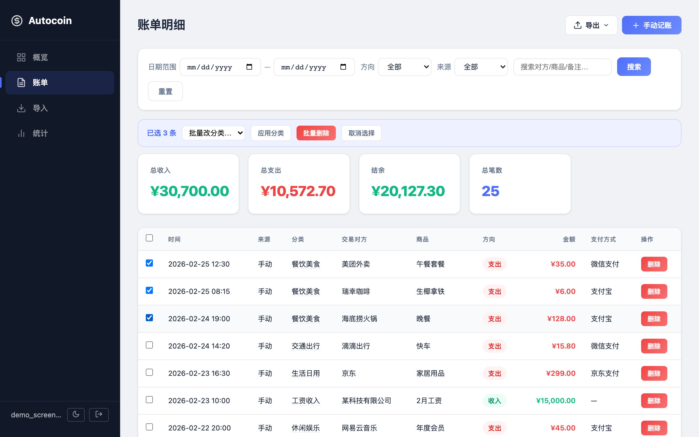 |

| 暗黑模式 - 概览 | 暗黑模式 - 账单 |
|:---:|:---:|
| 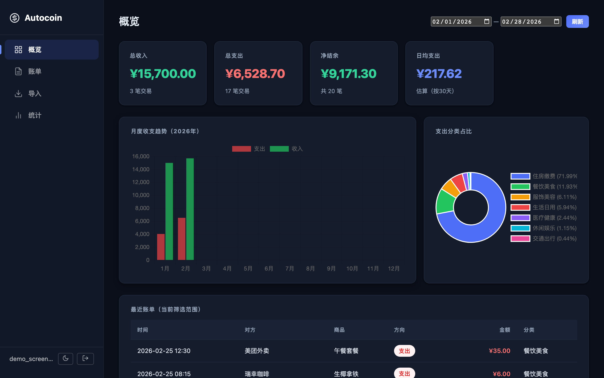 | 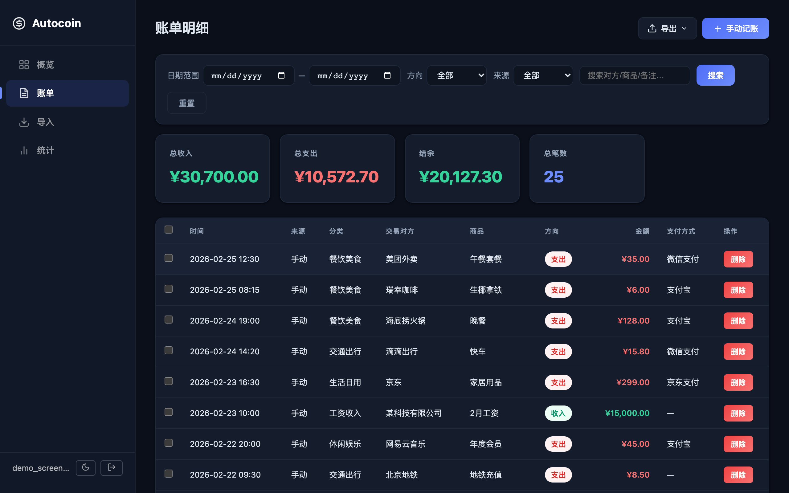 |

| 登录 |
|:---:|
| 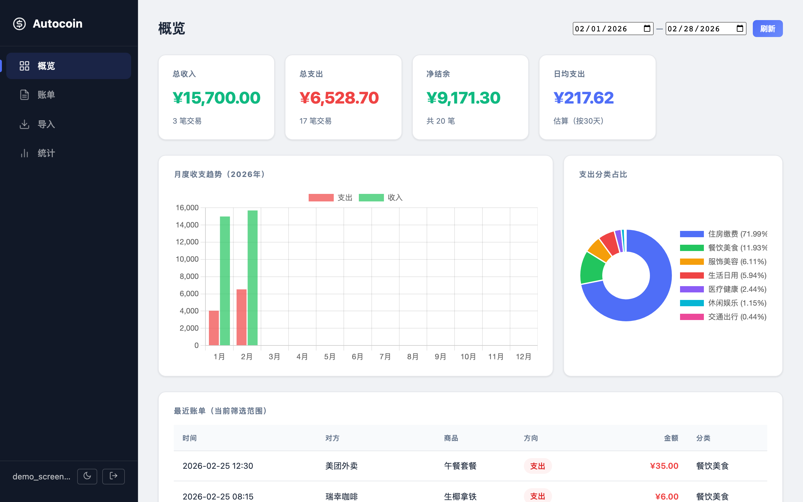 |

### 移动端

<p align="center">
  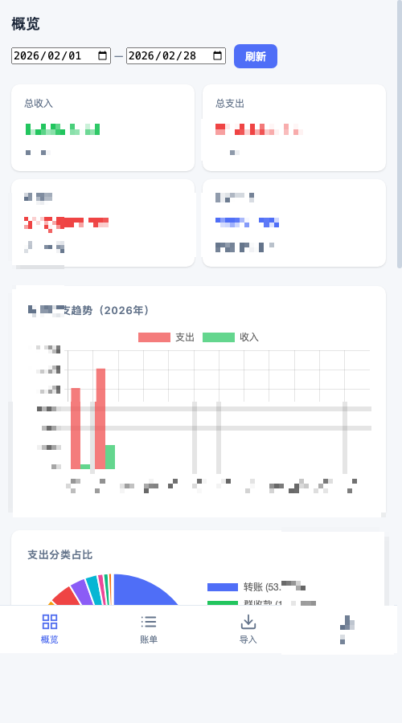
  &nbsp;&nbsp;
  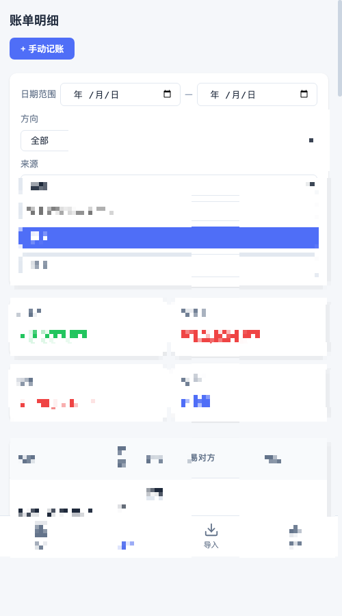
  &nbsp;&nbsp;
  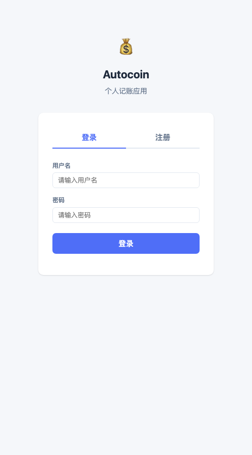
  &nbsp;&nbsp;
  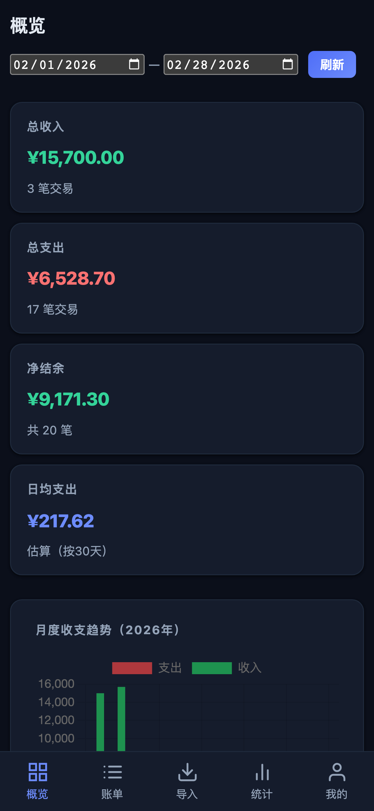
</p>

## 功能特性

### 核心功能

- **用户认证** — 注册/登录，JWT 鉴权，多用户数据隔离
- **账单导入** — 支持支付宝 CSV（GBK 编码）和微信支付 XLSX 文件，自动去重
- **图片智能导入** — 拍照或上传收据/截图，通过多模态 LLM 自动识别交易信息
  - 支持多家 LLM 提供商：OpenAI（GPT-4o-mini）、Google Gemini、智谱 GLM、通义千问、DeepSeek
  - 自动 Fallback：按优先级依次尝试已配置 API Key 的提供商
  - 内置去重检测：自动高亮已存在的重复交易，避免重复导入
  - 每日识别额度：按识别图片张数计算（默认每天 10 张）
  - 前后端格式校验：时间/金额/类型导入前自动检查，错误字段高亮提示
  - 导入记录保留真实图片文件名
  - 手机端支持拍照直接识别
- **手动记账** — 可手动录入其他来源的收支记录，支持分类自动补全
- **分类规则** — 支持按交易对方、商品说明、支付方式、原始交易类型配置自动归类规则
- **数据总览** — Dashboard 展示收支概况、月度柱状图、分类饼图、近期账单

### 数据管理

- **账单管理** — 分页浏览、筛选（日期/方向/来源）、搜索（对方/商品/备注/支付方式）
- **批量操作** — 多选账单后批量修改分类或批量删除
- **分类管理** — 分类自动补全（基于历史数据）、支持内联编辑
- **自动归类** — 规则命中后可自动补齐分类与备注，适用于手动录入和文件导入场景
- **数据导出** — 支持导出为 CSV 或 Excel（XLSX），可按当前筛选条件导出
- **实时汇总** — 账单页面根据当前筛选条件实时显示总收入、总支出、结余、总笔数

### 统计分析

- **年度统计** — 年度汇总卡片（收入/支出/结余）、月度收支趋势图、累计结余
- **分类分析** — 分类占比饼图、分类金额排行、分类钻取查看明细
- **灵活筛选** — 按日期范围、收支方向等维度自由筛选分析

### 体验优化

- **暗黑模式** — 一键切换浅色/深色主题，自动跟随系统偏好，设置持久化
- **移动端适配** — 底部 Tab 导航栏，响应式布局适配手机屏幕
- **精致 UI** — SVG 图标体系、渐变按钮、hover 微动画、毛玻璃卡片效果
- **安全加固** — 登录错误信息统一（防枚举）、JWT/CORS 安全警告

### 工程质量

- **自动化测试** — 36 个 pytest 测试用例覆盖解析器、图片识别、API 接口与分类规则
- **Docker 部署** — 提供 Dockerfile + docker-compose.yml 一键部署
- **可扩展架构** — 抽象 Repository 接口，便于未来对接远程 API

## 技术栈

| 层级 | 技术 |
|------|------|
| 后端框架 | FastAPI |
| 数据库 | SQLite（WAL 模式） |
| ORM | SQLAlchemy 2.0 |
| 数据校验 | Pydantic v2 |
| 认证 | JWT（python-jose + bcrypt） |
| 图片识别 | OpenAI SDK / Google GenAI SDK（多模态 LLM） |
| Excel 解析 | openpyxl |
| 前端 | 原生 HTML/CSS/JS（SPA，Hash 路由） |
| 图表 | Chart.js（CDN） |
| 测试 | pytest + httpx |
| 部署 | Docker + docker-compose |

## 项目结构

```
autocoin/
├── main.py                    # 应用入口
├── pyproject.toml              # 项目依赖配置
├── Dockerfile                  # Docker 镜像构建
├── docker-compose.yml          # 一键部署配置
├── autocoin/                   # 后端 Python 包
│   ├── app.py                  # FastAPI 应用工厂
│   ├── config.py               # 配置（环境变量 AUTOCOIN_ 前缀）
│   ├── auth.py                 # 认证工具（密码哈希、JWT、依赖注入）
│   ├── database.py             # 数据库引擎与会话管理
│   ├── models/                 # SQLAlchemy ORM 模型
│   │   ├── user.py             # 用户模型
│   │   ├── transaction.py      # 交易记录模型
│   │   ├── classification_rule.py # 自动分类规则模型
│   │   └── import_batch.py     # 导入批次模型
│   ├── repository/             # 数据访问层
│   │   ├── base.py             # 抽象接口（DataRepository）
│   │   └── sqlite.py           # SQLite 实现（按用户隔离）
│   ├── parsers/                # 账单解析器
│   │   ├── base.py             # 解析器抽象基类
│   │   ├── alipay.py           # 支付宝 CSV 解析（GBK）
│   │   └── wechat.py           # 微信支付 XLSX 解析
│   ├── services/               # 业务逻辑层
│   │   ├── import_service.py   # 文件导入服务
│   │   ├── image_recognizer.py # 图片识别服务（LLM）
│   │   └── stats_service.py    # 统计服务
│   ├── routers/                # API 路由
│   │   ├── auth.py             # 注册/登录
│   │   ├── transactions.py     # 账单 CRUD + 导出 + 批量操作
│   │   ├── imports.py          # 文件上传与导入 + 去重检测
│   │   ├── rules.py            # 分类规则 CRUD
│   │   └── statistics.py       # 统计查询
│   └── schemas/                # Pydantic 请求/响应模型
│       ├── auth.py
│       ├── classification_rule.py
│       ├── transaction.py
│       ├── import_schema.py
│       └── statistics.py
├── tests/                      # 自动化测试
│   ├── conftest.py             # 测试配置（临时数据库）
│   ├── test_parsers.py         # 解析器测试（9 个）
│   ├── test_image_recognizer.py # 图片识别测试（10 个）
│   └── test_api.py             # API 集成测试（14 个）
├── frontend/                   # 前端静态文件
│   ├── index.html              # SPA 入口
│   ├── css/styles.css          # 样式（响应式 + 暗黑模式）
│   └── js/
│       ├── api.js              # API 客户端 + Token 管理
│       ├── auth.js             # 登录/注册页
│       ├── app.js              # 路由、鉴权守卫、主题切换
│       ├── charts.js           # Chart.js 封装与工具函数
│       ├── dashboard.js        # 总览页
│       ├── transactions.js     # 账单页（含导出、批量操作）
│       ├── import.js           # 导入页（含图片去重）
│       ├── rules.js            # 分类规则页
│       └── stats.js            # 统计页
└── data/                       # 账单文件目录
```

## 分类规则使用说明

在“分类规则”页面可以创建自动归类规则。每条规则支持以下能力：

- 按交易对方、商品说明、支付方式、原始交易类型做包含匹配
- 通过优先级控制匹配顺序，数值越小优先级越高
- 命中后自动填充分类和备注
- 适用于手动新增账单和支付宝/微信账单文件导入

示例：

- `交易对方包含 = 美团`，`自动分类 = 餐饮美食`
- `交易对方包含 = 滴滴`，`自动分类 = 交通出行`
- `交易对方包含 = 星巴克` 且 `支付方式包含 = 微信支付`，`自动分类 = 咖啡饮品`

## 快速开始

### 环境要求

- Python >= 3.9
- [uv](https://docs.astral.sh/uv/) 包管理器（推荐）

### 安装与运行

```bash
# 克隆项目
git clone https://github.com/hnkjdaxzzq/autocoin.git
cd autocoin

# 安装依赖
uv sync

# 启动服务（默认 http://localhost:8000）
uv run python main.py
```

浏览器打开 `http://localhost:8000`，注册账号后即可开始使用。

### Docker 部署

```bash
# 使用 docker-compose 一键部署
docker compose up -d

# 或手动构建
docker build -t autocoin .
docker run -d -p 8000:8000 -v autocoin_data:/data autocoin
```

> **提示**：生产环境请通过环境变量设置 `AUTOCOIN_JWT_SECRET`：
> ```bash
> AUTOCOIN_JWT_SECRET=$(openssl rand -hex 32) docker compose up -d
> ```

### 运行测试

```bash
# 安装开发依赖
uv sync --extra dev

# 运行所有测试
uv run pytest tests/ -v
```

### 旧数据库迁移

如果你从没有用户系统的旧版本升级，需要执行一次迁移脚本，将已有数据关联到一个默认用户：

```bash
uv run python migrate_add_user.py
```

迁移后使用默认账号 `admin` / `changeme123` 登录，请及时修改密码。

### 环境变量

可通过环境变量覆盖默认配置（前缀 `AUTOCOIN_`）：

| 变量 | 说明 | 默认值 |
|------|------|--------|
| `AUTOCOIN_DATABASE_URL` | 数据库连接 | `sqlite:///autocoin.db` |
| `AUTOCOIN_JWT_SECRET` | JWT 签名密钥 | 开发用默认值（⚠️ 生产环境务必修改） |
| `AUTOCOIN_CORS_ORIGINS` | CORS 允许的域名列表 | `["*"]` |
| `AUTOCOIN_JWT_EXPIRE_MINUTES` | Token 过期时间（分钟） | `10080`（7 天） |
| `AUTOCOIN_LLM_PROVIDER_ORDER` | LLM 提供商优先级（逗号分隔） | `zhipu,qwen,deepseek,openai,gemini` |
| `AUTOCOIN_LLM_TIMEOUT` | LLM 请求超时（秒） | `60` |
| `AUTOCOIN_OPENAI_API_KEY` | OpenAI API Key | — |
| `AUTOCOIN_OPENAI_MODEL` | OpenAI 模型 | `gpt-4o-mini` |
| `AUTOCOIN_GEMINI_API_KEY` | Google Gemini API Key | — |
| `AUTOCOIN_GEMINI_MODEL` | Gemini 模型 | `gemini-2.0-flash` |
| `AUTOCOIN_ZHIPU_API_KEY` | 智谱 API Key | — |
| `AUTOCOIN_ZHIPU_MODEL` | 智谱模型 | `glm-4v-flash` |
| `AUTOCOIN_QWEN_API_KEY` | 通义千问 API Key | — |
| `AUTOCOIN_QWEN_MODEL` | 千问模型 | `qwen-vl-max` |
| `AUTOCOIN_DEEPSEEK_API_KEY` | DeepSeek API Key | — |
| `AUTOCOIN_DEEPSEEK_MODEL` | DeepSeek 模型 | `deepseek-chat` |
| `AUTOCOIN_IMAGE_IMPORT_DAILY_LIMIT` | 每账号每天图片识别上限 | `10` |

> **图片识别说明**：只需配置至少一个 LLM 提供商的 API Key 即可使用图片导入功能。系统会按 `LLM_PROVIDER_ORDER` 指定的顺序依次尝试已配置的提供商，直到识别成功或全部失败。国外 API（OpenAI、Gemini）会自动读取环境变量中的代理设置（`HTTPS_PROXY` / `HTTP_PROXY` / `ALL_PROXY`）。

## API 概览

所有接口前缀为 `/api/v1`。除注册和登录外，所有接口需要在请求头携带 `Authorization: Bearer <token>`。

### 认证

| 方法 | 路径 | 说明 |
|------|------|------|
| `POST` | `/auth/register` | 注册新用户（自动登录，返回 Token） |
| `POST` | `/auth/login` | 用户登录 |
| `GET` | `/auth/me` | 获取当前用户信息 |

### 账单

| 方法 | 路径 | 说明 |
|------|------|------|
| `GET` | `/transactions` | 分页查询账单（支持筛选、搜索，返回汇总统计） |
| `POST` | `/transactions` | 手动创建账单 |
| `GET` | `/transactions/{id}` | 获取单条账单 |
| `PUT` | `/transactions/{id}` | 更新账单（分类/备注/方向） |
| `DELETE` | `/transactions/{id}` | 软删除账单 |
| `GET` | `/transactions/categories` | 获取已有分类列表 |
| `GET` | `/transactions/export/csv` | 导出为 CSV |
| `GET` | `/transactions/export/excel` | 导出为 Excel |
| `POST` | `/transactions/batch/delete` | 批量删除 |
| `POST` | `/transactions/batch/update` | 批量更新分类/方向 |

### 导入

| 方法 | 路径 | 说明 |
|------|------|------|
| `POST` | `/imports` | 上传并导入账单文件 |
| `POST` | `/imports/image/recognize` | 上传图片，LLM 识别交易信息 |
| `POST` | `/imports/image/confirm` | 确认并导入识别结果（自动去重） |
| `POST` | `/imports/image/check-duplicates` | 检测重复交易 |
| `GET` | `/imports/image/quota` | 查询今日图片识别额度 |
| `GET` | `/imports` | 查看导入历史 |
| `GET` | `/imports/{id}` | 查看单次导入详情 |

### 统计

| 方法 | 路径 | 说明 |
|------|------|------|
| `GET` | `/statistics/summary` | 收支汇总 |
| `GET` | `/statistics/monthly` | 月度统计 |
| `GET` | `/statistics/category` | 分类统计 |
| `GET` | `/statistics/daily` | 每日统计 |

## 支持的账单格式

### 支付宝

- 格式：CSV 文件（GBK 编码）
- 来源：支付宝 App → 账单 → 导出

### 微信支付

- 格式：XLSX 文件
- 来源：微信 → 支付 → 钱包 → 账单 → 导出

导入时自动检测文件类型，支持批量拖拽上传，重复记录自动跳过。

### 图片识别导入

- 支持常见图片格式：JPG、PNG、WebP、HEIC
- 支持单张或批量上传（最多 10 张）
- 支持的图片类型：收银小票、支付截图、银行账单截图、手写记账等
- 识别结果支持预览、编辑后再导入
- 自动高亮已存在的重复交易
- 手机端支持相机直接拍照

## License

MIT
